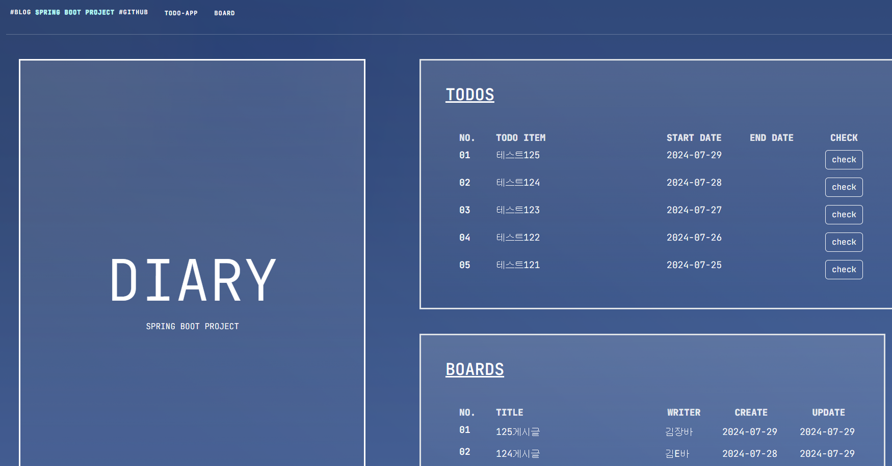
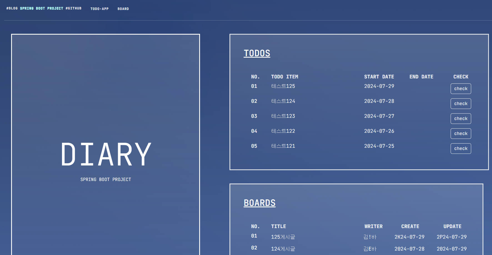
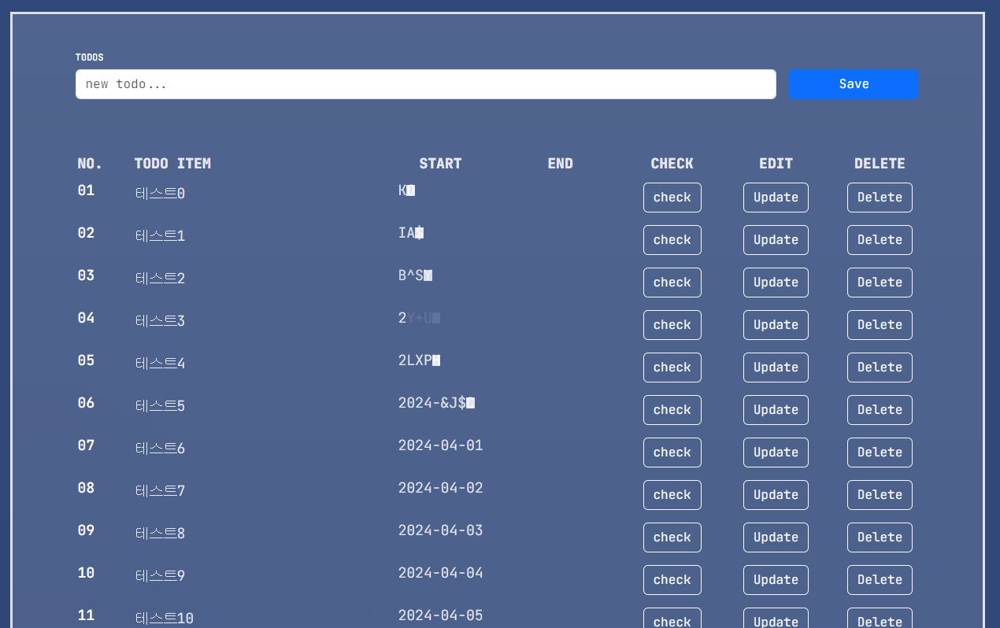
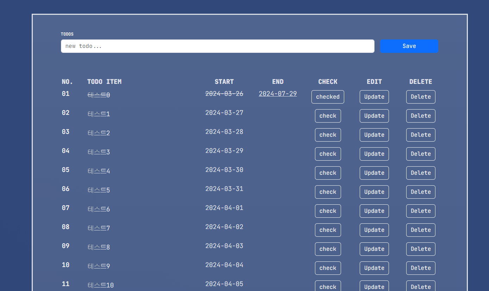
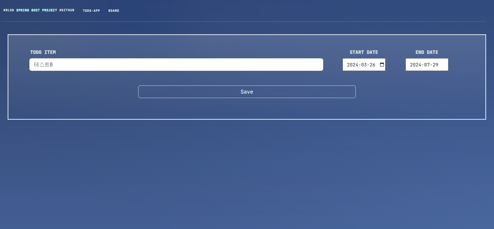
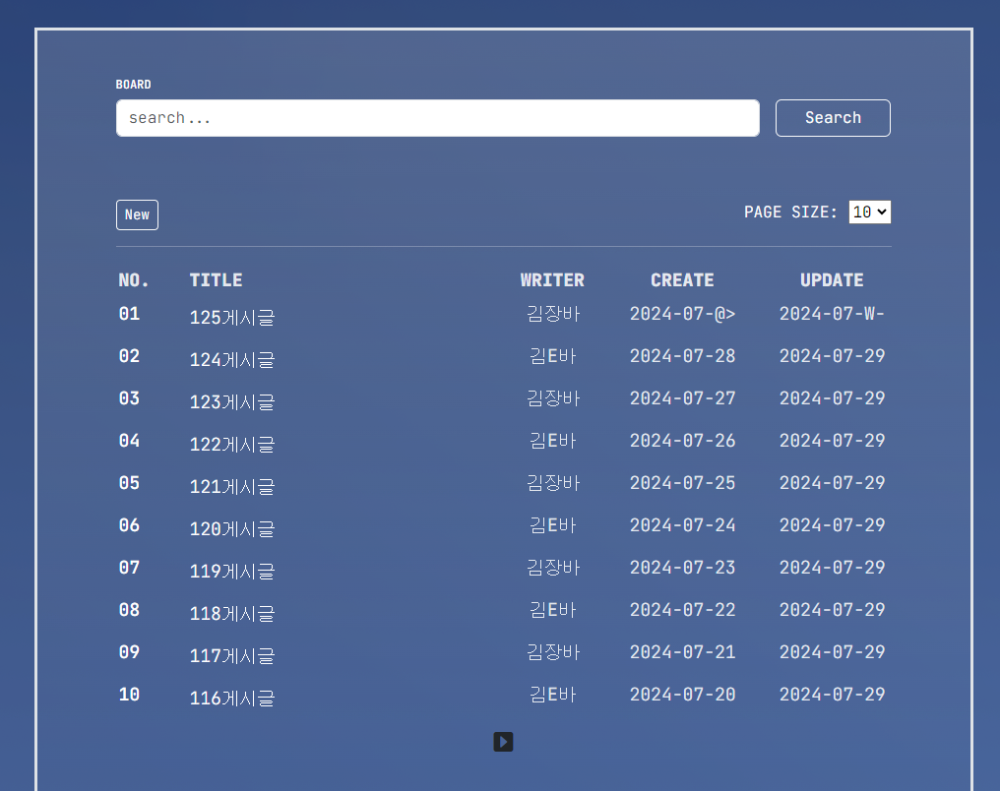
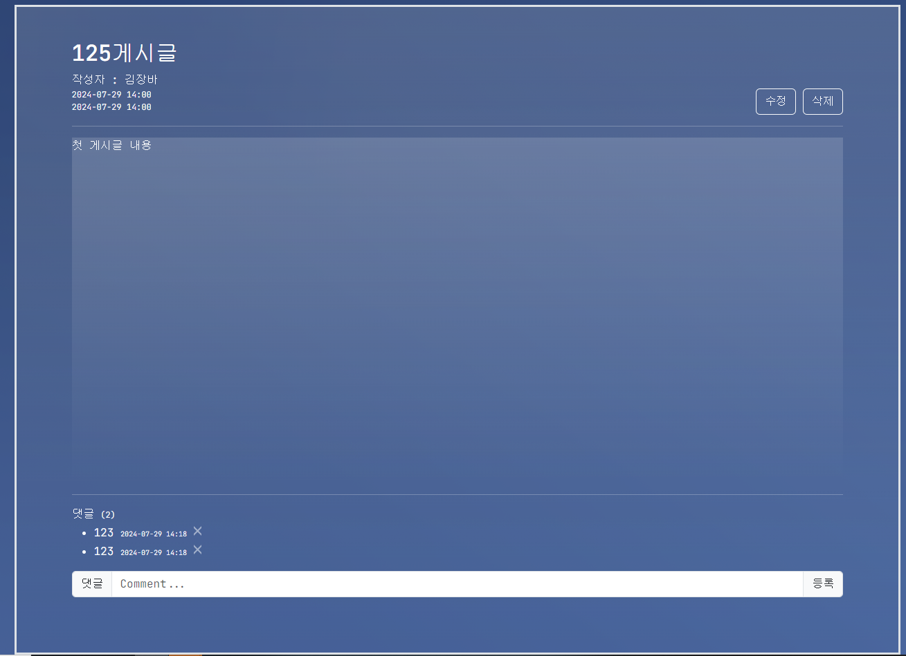
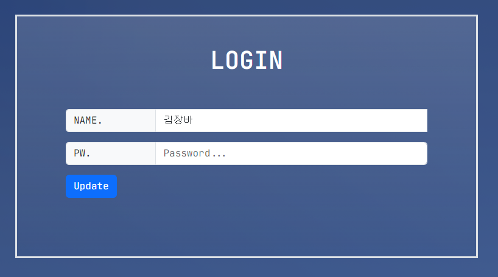
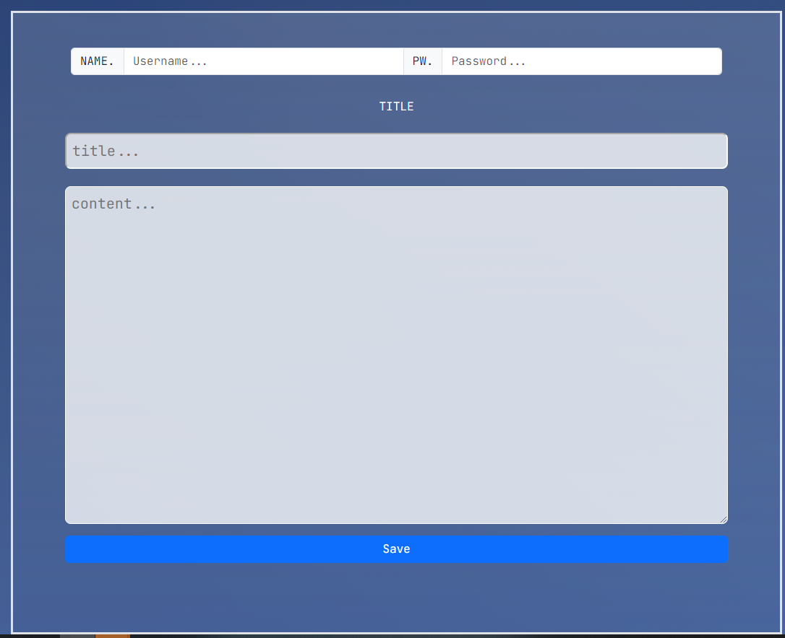
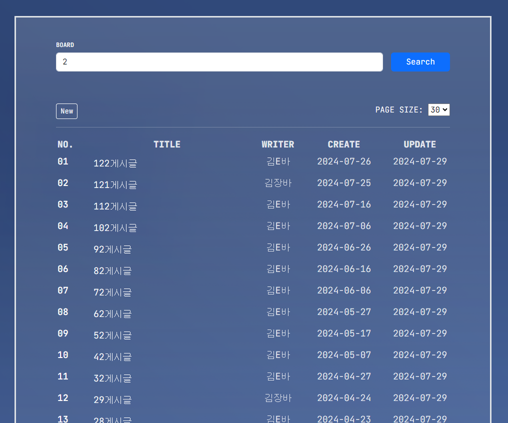

# 코리아 IT 아카데미 정처기
## 1. 프로젝트 제목 - Diary App
 - 🚗 할 일과 일기를 쓸 수 있는 게시판이 있는 다이어리 앱
<p align="center"></p>

## 2. 프로젝트 정보
- 코리아IT아카데미 정보처리기능사 개인 프로젝트

 - 애플리케이션 주요 기능
    1. 메인에는 할일 목록과 게시판 목록을 최대 5개까지 불러옴
    2. 할 일 CRUD 기능 구현
    3. 할 일 Check 시 실선이 생기며 종료날짜 저장
    4. 게시판 CRUD 기능 구현
    5. 게시판 글 작성 시 입력했던 비밀번호를 입력해야 수정 및 삭제가능
    6. 게시글 마다 댓글 작성 및 삭제 가능
    7. 게시판은 최신순으로 나열
    8. 게시판 페이징 처리


## 3. 프로젝트 소개
### 할 일을 메모하고 게시글을 작성할 수 있는 다이어리 애플리케이션
    - 할 일을 입력하고 저장하는 TODOS와 일기를 적을 수 있는 BOARDS와 각각의 일기에 COMMENT를 등록 할 수 있는 애플리케이션입니다.

## 4. 시작 가이드
### 요구 사항
- Spring Boot Starter Parent : 3.3.1
- Java Version : 17
### Installation
```
Spring boot > import > Maven > Existing Maven Projects > SpringBootProject
```
### Dependency
```
Spring Boot DevTools
Spring Data JPA
Spring web
Lombok
MySQL Driver
Thymeleaf
```


## 5. 기술 스택
### Environment

  

### Database


### Development
 


## 6. 화면 구성
| 메인 페이지         | TODOS 페이지       |
|------------------|------------------|
|  |  |
| TODOS - Check     | TODOS - 수정       |
|  |  |
| BOARD 페이지 | BOARD_Detail     |
|  |  |
| 로그인 페이지  | Board - 새글 등록            |
|  |  |
| Board - 검색 및 페이징 | - |
| | - |

## 07. 아키텍쳐
### 디렉터리 구조
```
C:.
├─src
│  └─main
│     ├─java
│     │  └─com
│     │      └─DiaryApp
│     │          │  DiaryAppApplication.java
│     │          │  MainCont.java                   - 메인컨트롤러
│     │          │  MessageDto.java                 - 오류메세지Dto
│     │          │
│     │          ├─board
│     │          │      BoardCont.java              - 게시판 컨트롤러 클래스
│     │          │      BoardDto.java               - 게시판 Dto
│     │          │      BoardRepo.java              - 게시판 저장소
│     │          │      BoardService.java           - 게시판 서비스 클래스
│     │          │
│     │          ├─comment
│     │          │      CommentDto.java             - 댓글 Dto
│     │          │      CommentRepo.java            - 댓글 저장소
│     │          │      CommentService.java         - 댓글 서비스 클래스
│     │          │
│     │          └─todo
│     │                  TodoCont.java              - 토도 컨트롤러 클래스
│     │                  TodoDto.java               - 토도Dto
│     │                  TodoRepo.java              - 토도 저장소
│     │                  TodoService.java           - 토도 서비스
│     │
│     └─resources
│         │  application.properties
│         │
│         ├─static
│         │  ├─css
│         │  │      style.css
│         │  │
│         │  ├─font
│         │  │      CookieRun Regular.ttf
│         │  │
│         │  ├─img
│         │  │      11111.png
│         │  │      23313751.jpg
│         │  │      favicon.png
│         │  │
│         │  └─js
│         │      │  gsap.min.js
│         │      │  split-type.min.js
│         │      │  textSplitter.js
│         │      │  utils.js
│         │      │
│         │      └─effect-1
│         │              index.js
│         │              text-animator.js
│         │
│         └─templates
│             │  board-detail.html              - Board 상세페이지
│             │  board-search.html              - Board 검색
│             │  board-update.html              - Board 수정페이지
│             │  board.html                     - Board 페이지
│             │  login.html                     - 로그인 페이지
│             │  mainPage.html                  - 메인 페이지
│             │  todos.html                     - Todos 페이지
│             │  update-todo.html               - Todos 수정페이지
│             │
│             └─common
│                     messageRedirect.html      - 오류 메세지 페이지
└─target

```